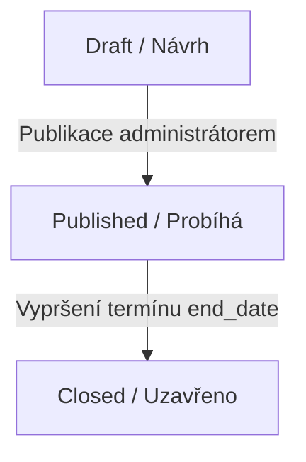

# Interní Hlasovací Portál (SkautIS) - Specifikace a Zadání

Tento dokument definuje požadavky a chování aplikace pro online hlasování rad jednotek (střediskových, okresních a krajských) s integrací na skautIS.

---

## 1. Přístup a Autentizace

### Veřejná část (Nepřihlášený uživatel)
- Stránka bude sloužit pouze jako rozcestník a informační nástěnka.
- Obsahuje obecné informace o portálu, nápovědu a výrazné přihlašovací tlačítko **„Přihlásit se přes skautIS“**.
- Nepřihlášený uživatel nevidí žádná konkrétní hlasování ani výsledky.

### Přihlášený uživatel
- Přihlášení probíhá výhradně přes centrální autentizaci skautIS.
- Po přihlášení aplikace získá:
  - **`skautIS_Token`** (identifikátor relace)
  - **`skautIS_IDUnit`** (ID aktivní jednotky, pod kterou se uživatel přihlásil)
  - **`skautIS_IDRole`** (ID aktivní role, např. delegát, vedoucí, administrátor)
  - Údaje o osobě (Person ID, jméno a příjmení)

---

## 2. Správa rolí a oprávnění (Autorizace)

Aplikace rozlišuje oprávnění na základě členství v **Radě jednotky** (seznam osob spravovaný v databázi) a administrativní role ze skautISu:

### A. Člen rady jednotky (Hlasující)
- **Kdo to je:** Přihlášený uživatel, který je zapsán na seznamu členů rady pro danou aktivní jednotku (`unit_id`). Tento seznam spravuje administrátor jednotky.
- **Práva:**
  - Vidí všechna aktivní (publikovaná) hlasování své jednotky a může v nich hlasovat.
  - Vidí všechna uzavřená hlasování své jednotky a jejich výsledky.

### B. Nečlen rady jednotky (Host / Bývalý člen)
- **Kdo to je:** Přihlášený uživatel ze skautISu, který ale není aktuálně na seznamu členů rady pro danou jednotku.
- **Práva:**
  - **Nevidí** nová ani běžící (aktivní) hlasování a nemůže v nich hlasovat.
  - V seznamu uzavřených hlasování vidí **pouze ta konkrétní hlasování**, kterých se v minulosti sám aktivně účastnil (tj. odevzdal v nich hlas). Ostatní uzavřená hlasování jsou pro něj skrytá.

### C. Administrátor jednotky (Správce)
- **Kdo to je:** Uživatel, jehož aktivní role ve skautISu odpovídá správci (např. role obsahuje klíčová slova `administrátor`, `vedoucí`, `místopředseda`, `tajemník` nebo má konkrétní práva v rámci skautIS API pro danou jednotku).
- **Práva:**
  - Spravuje seznam členů rady pro danou jednotku (přidávání osob vyhledáním z jednotky ve skautISu nebo přímým zadáním PersonID a odebírání ze seznamu).
  - Vidí všechna hlasování své jednotky (včetně rozpracovaných návrhů – *Draft*).
  - Může zakládat nová hlasování, upravovat je v režimu *Draft*, publikovat je nebo mazat.

---

## 3. Životní cyklus a stavy hlasování

Každé hlasování prochází následujícími stavy:

1. **Draft (Návrh):**
   - Nově vytvořené hlasování.
   - Viditelné **pouze pro administrátory** dané jednotky.
   - Lze jej libovolně upravovat, měnit možnosti hlasování nebo smazat.
2. **Published (Publikováno / Aktivní):**
   - Hlasování je viditelné pro všechny členy jednotky.
   - Lze v něm hlasovat.
   - Administrátor již nemůže měnit otázky ani možnosti, aby nedošlo k ovlivnění výsledků.
3. **Closed (Uzavřeno):**
   - Nastane automaticky po uplynutí nastaveného termínu (`end_date`).
   - Již nelze hlasovat.
   - Zobrazují se konečné výsledky.

---

## 4. Požadovaná data u hlasování

Při zakládání hlasování administrátor zadává:
- **Název (Téma):** Krátký výstižný název (např. *Schválení rozpočtu na rok 2026*).
- **Popis/Zadání:** Podrobné informace, odkazy na podklady apod.
- **Datum obdržení návrhu:** Kdy byl návrh oficiálně podán/přijat radou k hlasování (typ `DATE`).
- **Termín (Do kdy se hlasuje):** Přesné datum a čas ukončení hlasování (`end_date`).
- **Možnosti hlasování:** Jsou fixně dány systémem: **Pro**, **Proti**, **Zdržel se**. Tyto možnosti se automaticky vytvoří při založení hlasování.

---

## 5. Jmenovitost, integrita a vyhodnocení hlasování

- **Jmenovitost (Adresnost) a viditelnost:** 
  - Hlasování je jmenovité. V databázi se u každého hlasu ukládá `person_id` a `person_name` hlasujícího člena rady.
  - **Kdo vidí detailní seznam:** Pouze **uživatel, který hlasování založil**, a **všichni členové rady** jednotky vidí v detailu hlasování seznam všech hlasujících, zda již hlasovali, jak hlasovali (Pro / Proti / Zdržel se), a kdo dosud nehlasoval. Tento seznam je jim dostupný jak v průběhu aktivního hlasování, tak po jeho skončení.
  - **Hosté (nečlenové rady):** Pokud nečlen rady přistupuje k uzavřenému hlasování, kterého se účastnil, vidí pouze anonymní souhrnné výsledky (graf, počty) a celkové vyhodnocení, nikoliv jmenný seznam hlasů.
- **Zamezení duplicitám:** Jeden uživatel může v rámci jednoho hlasování odevzdat pouze jeden hlas.
- **Vyhodnocení usnesení:** 
  - Po vypršení termínu (`end_date`) se hlasování vyhodnotí na základě počtu členů rady v dané jednotce v době vyhodnocení.
  - **Pravidlo pro přijetí:** Usnesení je **přijato**, pokud počet hlasů **„Pro“** tvoří **více než polovinu (nadpoloviční většinu) všech členů rady** dané jednotky. V opačném případě usnesení **přijato nebylo**.
  - Aplikace přehledně zobrazí celkový počet členů rady, kolik členů hlasovalo (a jak) a kolik se jich neúčastnilo.

---

## 6. E-mailové notifikace a spouštění na běžném hostingu (Cron)

### E-mailové notifikace
Aplikace automaticky odesílá e-maily v následujících situacích:
1. **Oznámení o novém hlasování:** Po publikaci hlasování (přechod z *Draft* do *Published*) se všem aktuálním členům rady dané jednotky odešle e-mail s informací, že bylo zahájeno hlasování, termínem ukončení a odkazem na detail v aplikaci.
2. **Oznámení výsledků:** Po vypršení termínu hlasování (`end_date`) se všem členům rady odešle e-mail se souhrnnými výsledky (jak bylo hlasováno, celkový počet hlasů a konečný verdikt, zda usnesení bylo či nebylo přijato).

### Nastavení SMTP (pro každou jednotku zvlášť)
- V databázi se pro každou jednotku ukládá její vlastní nastavení SMTP (server, port, uživatel, heslo, typ šifrování, odesílací e-mail a jméno).
- Administrátor jednotky má v aplikaci formulář pro správu tohoto SMTP nastavení. E-maily dané jednotky pak odcházejí z její vlastní adresy (např. `strediskoXY@skaut.cz`).

### Spouštění periodických úloh (Cron) na běžném hostingu
Pro vyhodnocování termínů a odesílání e-mailů na pozadí aplikace obsahuje mechanismus periodického spouštění, který je kompatibilní i s nejlevnějším webhostingem (např. Wedos, Active24):
1. **Způsob A (Web Cron):** Aplikace vystaví zabezpečenou URL adresu (např. `http://domena.cz/cron/run?token=tajny_token`). V administraci hostingu stačí nastavit periodické volání této URL adresy (např. každých 5 minut).
2. **Způsob B (CLI Cron):** Na pokročilejším hostingu nebo VPS lze úlohu spouštět přímo z příkazové řádky přes CLI skript (`bin/cron.php`).

Cron na pozadí zkontroluje nově publikovaná hlasování (odešle pozvánky) a hlasování po termínu (vyhodnotí je, změní stav na `closed` a rozešle výsledky). Tím se zabrání zasekávání webového rozhraní při odesílání desítek e-mailů.
